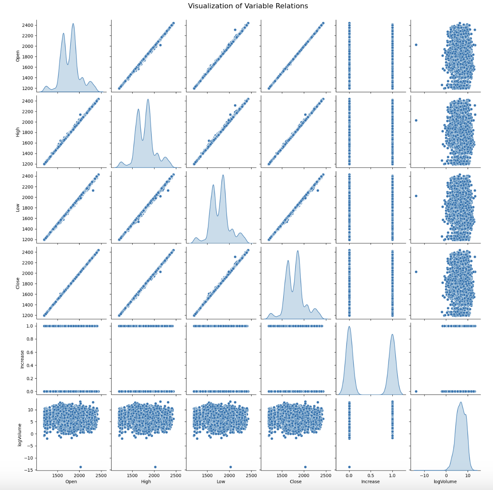
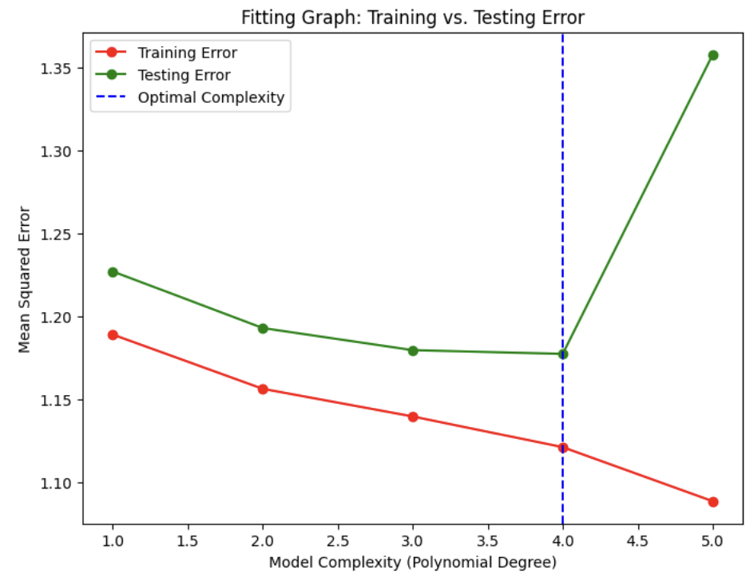
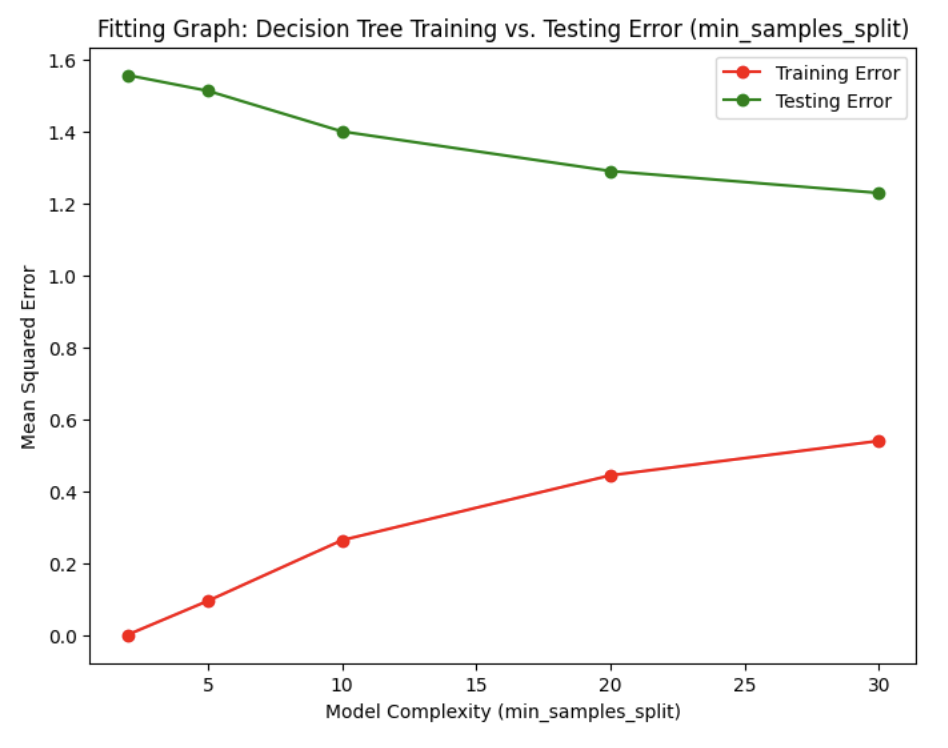
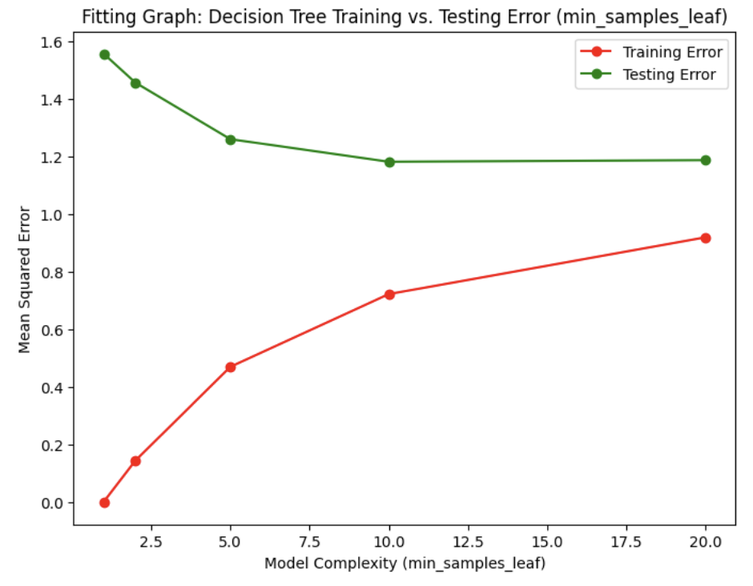
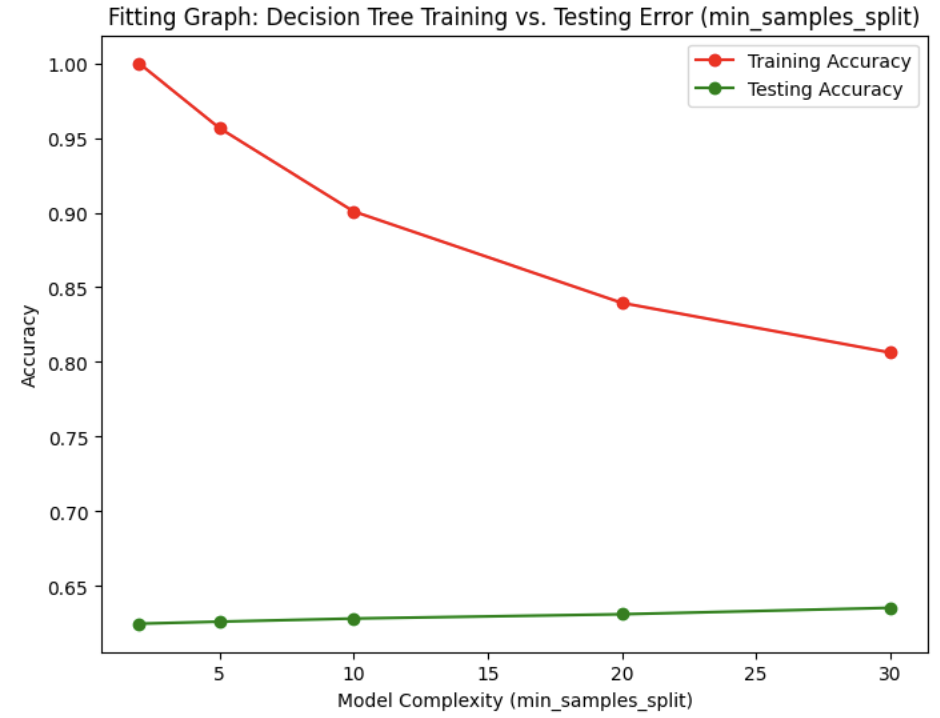
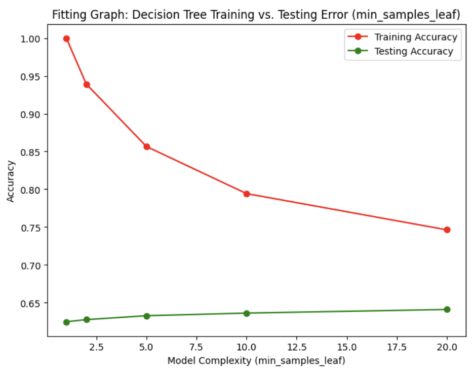
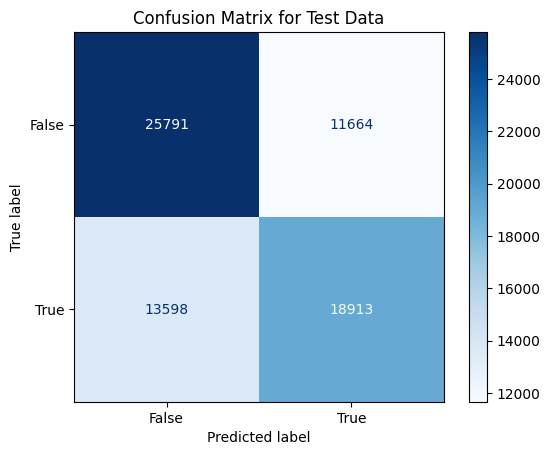

# cse151_project
Group Project Repository for CSE 151A

## [Link to dataset](https://www.google.com/url?q=https://www.kaggle.com/datasets/imranbukhari/comprehensive-ethusd-1m-data/data&sa=D&source=docs&ust=1730502587695059&usg=AOvVaw3kMqZe-yQhr2LT-L_PQyeM)

For our preprocessing, we will not need to impute any missing values because we found that there were no null values during our data exploration. The data is originally represented in 1 minute intervals with `Open`, `High`, `Low`, and `Close` prices, but there is very minimal change to be found within such a short interval. Thus, we condense our data into 10 minute intervals by manually calculating the corresponding price points. In addition, we filter our data to only contain rows from the year 2023 to limit the size of our dataset to fit github constraints. We then log transform the 'Volume' column because it is skewed and the scale of the data is larger than the other numerical volumes. This will make the data easier to analyze and prepare it for machine learning models. Since there are no categorical variables, we will not need to do any encoding.

In Milestone 3, we decided to save a snapshot and reduce our dataset to 300 thousand data points due to its constant increasing size by the daily addition of new data. After preprocessing, we created a model using linear regression and plotted our coefficients and intercepts to visualize our model's performance. Upon reviewing the graph and evaluation metrics, we answered the required questions, determined next steps to try with our model, and wrote a conclusion.

In Milestone 4, we first decided to go back and MinMax scale our data. We then reran our initial model from milestone 3 and implemented a DecisionTreeRegressor using RandomizedSearchCV to find optimal hyper parameters. Afterwards, we plotted the fitting graphs of the DecisionTreeRegressor's train and test errors at different parameter values for both min_samples_split and min_samples_leaf. Our new conclusions were then gathered at the end of our notebook.

## Introduction

We chose this Ethereum dataset because cryptocurrency represents a cutting-edge intersection of technology, finance, and societal change, making it highly relevant in the modern world. Ethereum, in particular, is not just a cryptocurrency but also a decentralized computing platform that enables the creation of smart contracts and decentralized applications. It has revolutionized industries such as finance, gaming, and supply chain management, offering secure, transparent, and efficient solutions to complex problems. Millions of individuals and organizations worldwide actively invest in and utilize Ethereum, making it a real-world asset with substantial economic, technological, and cultural significance.

What makes this project exciting is the opportunity to work with data from such a groundbreaking domain. Predicting Ethereum's price and performance is cool because it challenges us to explore and apply advanced machine learning techniques to a volatile and dynamic market. Additionally, the insights derived from analyzing Ethereum's historical data could have practical applications, such as guiding investment decisions, improving financial risk management, and informing broader discussions about the adoption of blockchain technologies.
Building a reliable predictive model for Ethereum can benefit many people, not just individual projects. It can help investors, companies, and even our team make smarter decisions by giving more accurate insights into market trends. These models can improve how people manage their investments, support smarter automated trading, and lower the risks tied to cryptocurrency's unpredictable nature. They can also help others learn about blockchain technology and use it responsibly, helping the digital economy grow and become more stable.
In summary, working on Ethereum data is not only highly relevant and engaging but also offers the potential to contribute to real-world financial advancements and foster broader understanding and utilization of blockchain innovations.

## Figures

### Data Exploration

 

 We graphed a kde plot better to understand the correlation of features between each other. We discovered that the columns “Open”, “High”, and “Low” all have a strong correlation with our predicting column “Close”. 

### Model 1: Linear Regression for Close

When graphing the different degrees of our train and test mean squared error, we found that our model performed best at degree 4. When our degree of freedom was 4, our train MSE was 1.1214 and our test MSE was 1.776. Based on these results, this suggests that our model was able to capture underlying patterns during the training data and was able to get a good generalization on the test set. After analyzing these results, we decided to explore a decision tree to better improve the model’s performance by catching the patterns the polynomial regression model did not catch. 

### Model 2: Decision Tree Regressor for Close

After performing our decision tree, we found that our model has the best validation score when the min_samples_split is 5 and the min_sample_leaf is 10. Our model performed with a training MSE of 0.7219 and a testing MSE of 1.1819. Our decision tree demonstrates a good generalization of the data since the gap between the testing and training MSE is relatively small, however, the best model does not seem to simply be the model with the closest train and test errors because we can observe better models in that metric in our fitting graph. 

### Model 3: Decision Tree Classifier for Increase

We found the best min_samples_split is 30 and the min_sample_leaf is 50. Our model performed with a train accuracy of 0.70 and a test accuracy of 0.639. This model had the best validation accuracy. There are no significant signs of overfitting since the gap between the train and test accuracy is fairly small. 

When looking at the confusion matrix, we can see that the false negative is 13598. Now calculating the recall for the true class would is 18913/(18913+13598) which results in 58%. This is also shown in the classification report. Our recall of 58% for the true class may potentially suggest underfitting. 

## Methods

### Data Preprocessing:

We began by loading the dataset and examining its structure. Each row represented stock data at 1-minute intervals, including variables such as Open, Close, Volume, High, and Low. Upon review, we observed that the 1-minute interval was too granular, with minimal variation between consecutive rows. To address this, we aggregated the data into 10-minute intervals, combining rows to capture more substantial changes in the stock variables. This adjustment simplified the dataset and made it more practical for analysis. We then created an ‘Increase’ column that evaluated to true or false depending on whether the price of the stock increased at the end of the interval or not. We used this as an additional predictor for future models utilizing classification. During our data exploration, we noticed that the “Volume” column contained large outliers that skewed the data. We addressed this issue by applying a log transformation to the column which reduces the influence of the outliers, reduces the skewness, and makes the distribution closer to a Gaussian distribution. We also Min-Max scaled the numeric columns to bring all the values to a common scale since columns like “Open” and “High” had a larger range of values than the “Volume” column. This ensures that no single column’s range disproportionately affects the results of our model. We checked for null values in our columns and found none as this is a complete dataset.

### Data Exploration:

To explore the data, we started with univariate analysis to understand the distributions of the individual variables. Specifically, we created histograms for the variables opening price, highest price for trading period, lowest price for trading period, and volume. Next, we performed bivariate analysis, by creating a pair plot, to visualize the correlations between all pairs of variables. These plots helped us identify patterns whether or not these relationships are linear or nonlinear. 

### Model 1: Linear Regression for Close

For the first model, we performed linear regression to predict the close price of the stock given the open, high, low, and logVolume variables. We fit the data to a Linear Regression model and obtained a testing mean squared error of 1.23. We visualized the weights of each feature using a scatter plot to see how the variables performed against the close value. We then plotted a fitting graph using different polynomial regressors and found that the best degree for the polynomial features was a degree of 4, so that would be the best parameter for this model.

### Model 2: Decision Tree Regressor for Close

For the second model, we implemented a decision tree regressor to predict the close price of the stock given the open, high, low, and logVolumn input features. After dividing the dataset in a training set (80%) and testing set (20%), we performed a randomized search cross validation to identify the best hyperparameters for our model. The hyperparameters we tuned were max_depth, min_samples_split, and min_samples_leaf. For our randomized search, we tested 10 combinations of hyperparameters and 5-fold cross-validation with the best hyperparameters chosen based on the lowest negative mean squared error during cross-validation. After tuning, the best hyperparameters were identified to be a max_depth of None, min_samples_split of 5, and a min_samples_leaf of 10. 

### Model 3: Decision Tree Classifier for Increase

For the third model, we implemented a decision tree classifier to predict the ‘Increase’ column. This would give us insight as to whether or not we can accurately predict if the price of Ethereum will increase by the end of the interval which would help inform decisions to purchase stock. We continued to divide the data into an 80% training set and 20% testing set using 5 fold randomized search cross validation to optimize the hyperparameters of our model. We tuned min_samples_split, min_samples_leaf, and max_depth and found that the best combinations of hyperparameters was min_samples_split=5, min_samples_leaf=10, and max_depth=None. 

## Results

For the third model, we implemented a decision tree classifier to predict the ‘Increase’ column. This would give us insight as to whether or not we can accurately predict if the price of Ethereum will increase by the end of the interval which would help inform decisions to purchase stock. We continued to divide the data into an 80% training set and 20% testing set using 5 fold randomized search cross validation to optimize the hyperparameters of our model. We tuned min_samples_split, min_samples_leaf, and max_depth and found that the best combinations of hyperparameters was min_samples_split=5, min_samples_leaf=10, and max_depth=None. 

### Model 1: Linear Regression for Close

After running the linear regression model, we achieved a training mean squared error (MSE) of 1.19 and a testing MSE of 1.23. These results indicate that the model generalizes reasonably well to unseen data, as the testing error is only slightly higher than the training error. 

After visualizing different polynomial models’ performance with the fitting graph, we found that a polynomial degree of 4 provided a better fit for the data. This suggests that incorporating more complex feature interactions improves the model's ability to capture the underlying patterns in the data. The scatter plot of feature weights revealed that variables like high and low had the strongest influence on predicting the close price, while the logVolume and open had relatively smaller impacts. This confirms the importance of price-related features in forecasting the stock's close price.

### Model 2: Decision Tree Regressor for Close

After implementing the decision tree regressor with randomized search cross validation, we found our best model to perform with a training MSE of 0.7219, testing MSE of 1.1819, and validation MSE of 1.259. This implies that our optimized decision tree regression model outperforms our original linear regression model because it has both a lower train and test MSE.

### Model 3: Decision Tree Classifier for Increase

Our third model which used a decision tree classifier to predict the ‘Increase’ column was able to perform moderately well. Our best model achieved a train accuracy of 0.70, a test accuracy of 0.639, and a validation accuracy of 0.633. This indicates that we were able to correctly predict whether the price of the stock increased more often than not, although there is still room for improvement. 

## Discussion

For our data preprocessing, we started by aggregating the data into 10-minute intervals in order to capture significant changes in the stock variables making the data more meaningful. We created an ‘Increase’ column to track whether or not the price of the stock increased after the 10-minute interval. However, we found this to be problematic because it gives information on the close column which is our target. As a result, we did not use the increase column as a feature in our first two models because it would create a strong correlation between the feature and the target. 

We then graphed the kde of our features to get a visual representation of the relation of our features. From this graph we noticed that the columns “Open”, “High”, “Low”, and “Close” are strong features.

Next, we noticed that the ‘Volume’ column had large outliers and we addressed this using log transformation. This was done for our model to better interpret the data and reduce the skewness bringing it closer to Gaussian. 

### Model 1: Linear Regression for Close

Our first model, Linear Regression, showed a test Mean Squared Error of 1.23. This is a reasonable performance considering the complexity and unpredictability of stock price movements. Linear regression assumes a perfect linear relationship between the features and the target. Our “Open”, “High”, and “Low” features showed a rough linear pattern when plotted against the target variable “Close”. However, they strayed away from our red linear regression line indicating that the relationship is not perfectly linear which makes sense as stock prices often exhibit non-linear behavior. It is interesting to note that after plotting our fitting graph, we found that a polynomial feature regression with degree=4 had the best performance before higher degree features became overfitted. Continuing work to improve this model could include feature engineering more complicated, compound features combined with a degree 4 polynomial feature regression to see how accurate of a model we can achieve.

### Model 2: Decision Tree Regressor for Close

Our second model, decision tree regressor, showed a test mean squared error of 1.18. We predicted the ‘Close’ price of the stock given the input features 'Open', 'High', 'Low', and 'logVolume’. From our fitting graphs, we visualize the relationships between train and test error as our hyperparameters make our model more complex and observe that simpler models actually have larger disparity between train and test error despite having the best validation scores. We could further improve this model with feature engineering, even deeper hyperparameter exploration, or even using an ensemble learning model such as a random forest decision tree regressor. It is interesting to see that the best validation score model had a max_depth=None because a tree with no max depth could be susceptible to overfitting. Overall, we found that this model performed better than our baseline linear regression model in both train and test error.

### Model 3: Decision Tree Classifier for Increase

The decision tree classifier we implemented achieved a test accuracy of 0.639. While this performance is better than random guessing, it leaves room for improvement if we intend to use this model in a real-world trading context. Predicting the 'Increase' class accurately is important for trading decisions, and the current accuracy might not yield consistent financial benefits. The hyperparameter tuning process using RandomizedSearchCV identified the optimal configuration to be a decision tree with no maximum depth, a minimum of 20 samples required for a split, and a minimum of 50 samples per leaf. This suggests that the model benefits from a higher level of regularization, likely preventing overfitting on the training data. The feature importance scores reveal that the Open price contributed most to the predictions, followed by High, Low, and logVolume. The relatively low contribution of logVolume (7.4%) suggests that it may have less predictive value in this dataset or requires transformation to better capture its relationship with the target variable. To enhance the model's performance, we can do feature engineering like calculating moving averages to better capture market dynamics. We can also use ensemble methods and expand the search space for hyperparameters to test more combinations and fine-tune the model further. 

### Data Leak Issue
Our project faces a potential data leakage issue because our training data might have inforamtion overalpped with the test data. This is an issue because our training data should not include anything from our test data. We could have addressed this by creating a temporal split to avoid leakage. We could have the data from one interval be training and then data from another interval be test. The features we used to predict our data include 'Open', 'High', 'Low', and 'logVolume' but these features contain a leak to the close column. This is because we only know the 'High' and 'Low' values after the day the market closes. We could have addressed this by shifting the close column by one interval.

## Conclusion

Throughout this project, we have delved into the complex area of Ethereum price prediction by employing a variety of machine learning models. The volatile nature of the cryptocurrency market and trading presented unique challenges to extract meaning out of our complex data. Our exploration from data preprocessing to advanced modeling techniques has provided us with valuable insights into the behavior of Ethereum prices over time.

In our analysis, we observed that while simpler models like linear regression offered a baseline for prediction, more sophisticated models such as decision tree regressors and classifiers showcased an ability to capture more nuanced patterns within the data. Each model highlighted different aspects of the data's characteristics and predictive potential, leaving a lot of promising methods for further exploration. 

Significant takeaways from our work include the differences in the capabilities of various predictive models and the insights we gained from understanding model complexity. Through the fitting graphs, we observed the trade-offs between model simplicity and accuracy. These visualizations not only helped us adjust the complexity of our models, such as polynomial degrees in regression and depth in decision trees, but also showed us how these adjustments impacted performance. This highlights the importance of carefully managing model complexity in order to avoid overfitting in machine learning practices.

For future work, we found a lot of promise in feature engineering and deeper hyperparameter tuning for more complex models. Additionally, experimenting with ensemble methods or advanced neural networks could lead to even more accurate and reliable predictions. The dynamic and unpredictable nature of Ethereum demands continuous refinement of models and approaches, but would offer valuable practicality if done well and could generalize into the field of quantum trading.

This project not only advanced our understanding of machine learning applications in financial markets but also demonstrated the potential of blockchain data to inform investment strategies and technological innovations. As we move forward, the lessons learned here will guide our ongoing journey into the intersection of technology, finance, and data science.

## Statement of Collaboration

- Derrick Nguyen: code (distribution graphs, model 1), writing (readme, introduction, results), set up meetings, pushed code to github
- Amelia Lei: code (distribution graphs, preprocessing, model 1 and 2), writing (methods, results)
- Jahnavi Naik: code(data exploration, fitting graphs, helped with model 1 and 2), writing (methods) 
- Owen Shi: code (preprocessing, model 3), writing (conclusion)
- Eunice Cho: code (model 3, conclusion), writing (methods, results)
